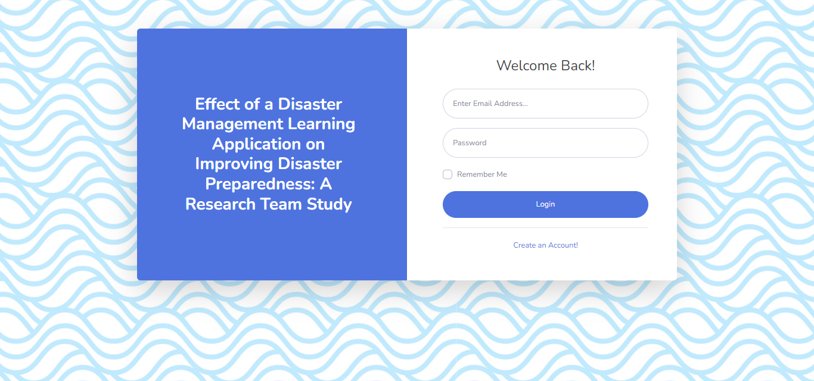
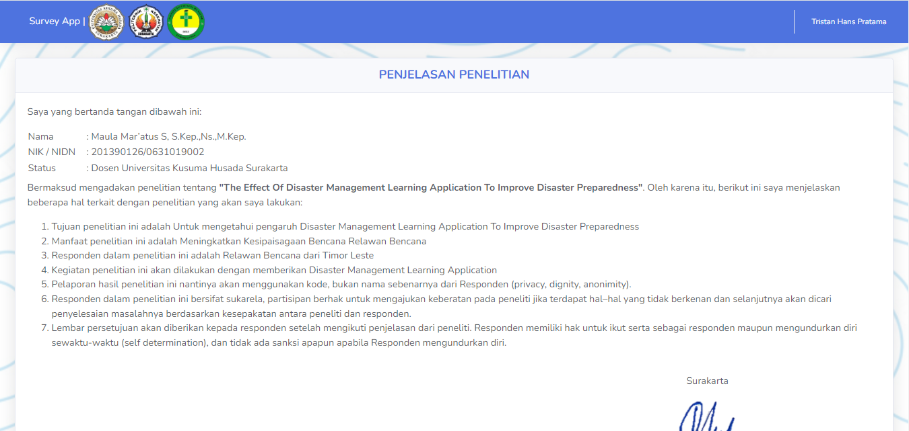
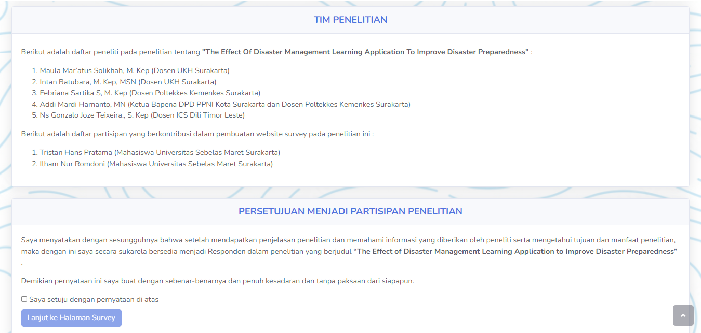
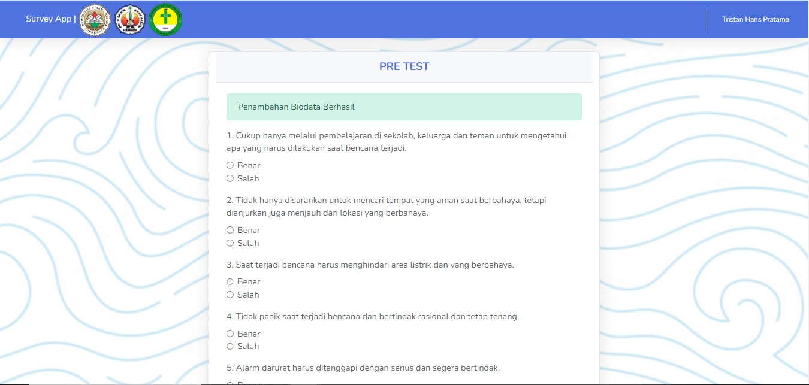
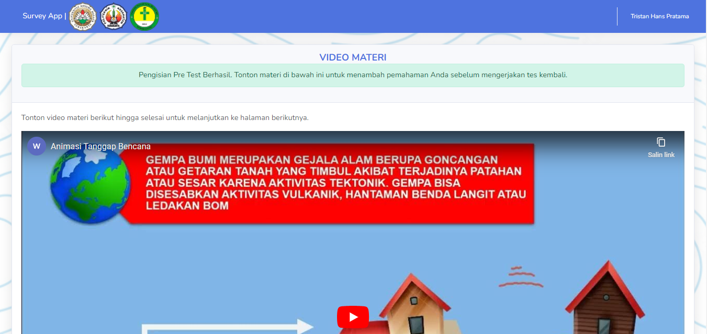
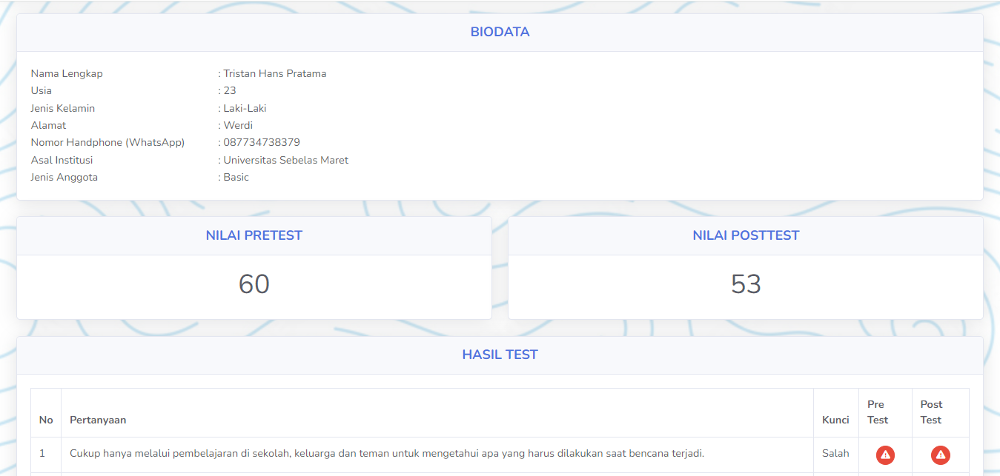
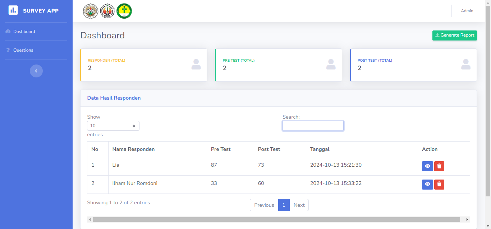
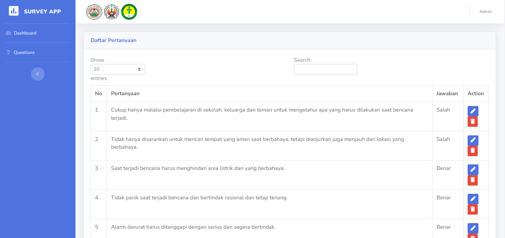

# Disaster Management Learning Application

## 📋 Overview
A Laravel-based web application designed to improve disaster preparedness among disaster volunteers in Timor Leste. This research project aims to evaluate the effectiveness of digital learning tools in enhancing disaster awareness and preparedness capabilities.

## 🎯 Research Objectives
- To assess the impact of digital learning applications on disaster preparedness
- To enhance disaster awareness among disaster volunteers
- To provide an accessible platform for disaster management education

## 🔍 Project Description
This application serves as an educational platform for disaster volunteers, focusing on:
- Comprehensive disaster management training
- Interactive learning modules
- Assessment of disaster preparedness levels
- Real-time progress tracking

## 💻 Technical Stack
- **Framework:** Laravel
- **Frontend:** Bootstrap
- **Database:** MySQL
- **Server Requirements:**
  - PHP >= 8.0
  - Composer
  - Node.js & NPM
  - MySQL

## 🚀 Installation

1. Clone the repository
```bash
git clone https://github.com/yourusername/disaster-management-app.git
```

2. Install PHP dependencies
```bash
composer install
```

3. Install NPM dependencies
```bash
npm install
```

4. Create environment file
```bash
cp .env.example .env
```

5. Generate application key
```bash
php artisan key:generate
```

6. Configure database in .env file
```
DB_CONNECTION=mysql
DB_HOST=127.0.0.1
DB_PORT=3306
DB_DATABASE=your_database_name
DB_USERNAME=your_username
DB_PASSWORD=your_password
```

7. Run migrations
```bash
php artisan migrate
```

8. Start the development server
```bash
php artisan serve
```

## 📊 Research Methodology
### Target Participants
- Disaster volunteers from Timor Leste
- Voluntary participation with right to withdraw
- Anonymous data collection and reporting

### Data Collection
- Participant responses are coded for anonymity
- Privacy and dignity of participants are prioritized
- Consent forms are provided after detailed explanation

### Ethical Considerations
- Voluntary participation
- Right to withdraw at any time without consequences
- Anonymous data handling
- Informed consent
- Participant privacy protection

## 👥 Research Team
This is a collaborative research project involving health science faculty members from multiple universities:
- Maula Mar’atus Solikhah, M. Kep (UKH Surakarta Lecturer)
- Intan Batubara, M. Kep, MSN (UKH Surakarta Lecturer)
- Febriana Sartika S, M. Kep (Poltekkes Kemenkes Surakarta Lecturer)
- Addi Mardi Harnanto, MN (Poltekkes Kemenkes Surakarta Lecturer)
- Ns Gonzalo Joze Teixeira., S. Kep (ICS Dili Timor Leste Lecturer)
- Tristan Hans Pratama (Graduated Student Universitas Sebelas Maret Surakarta)
- Ilham Nur Romdoni (Graduated Student Universitas Sebelas Maret Surakarta)

## 🙏 Acknowledgments
- All participating universities and faculty members
- Disaster volunteer participants
- Supporting organizations in Timor Leste

---
**Note:** This project is part of an academic research initiative. All data collected will be used solely for research purposes and handled with strict confidentiality.

## 📸 More Screenshots

### Login Page

### Info Page

### Agreement Page

### Pretest Page

### Materi Page

### Result Page

### Dashboard Admin Page

### Questions Page


